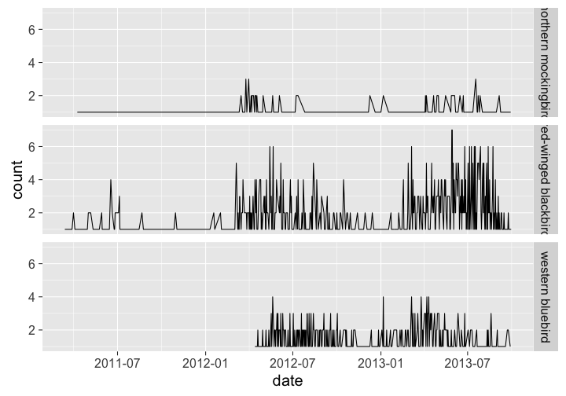

rnpn
========


[](https://travis-ci.org/ropensci/rnpn)
[](https://ci.appveyor.com/project/sckott/rnpn/branch/master)

`rnpn` is an R client for the US National Phenology Network API.

National Phenology Network [API documentation](https://docs.google.com/document/d/1yNjupricKOAXn6tY1sI7-EwkcfwdGUZ7lxYv7fcPjO8/edit?hl=en_US).

Note that there is no need for an API key to grab data from the National Phenology Network, but I think there is for writing data through the API. Currently, functions in this package only allow getting data, but may at some point allow posting data to the USNPN.

## Quick start

### Installation

Note: Windows users installing from GitHub should get Rtools - can be installed from http://www.murdoch-sutherland.com/Rtools/


```r
install.packages("devtools")
devtools::install_github("ropensci/rnpn")
```


```r
library('rnpn')
```

### Lookup names

You can lookup taxon names. This is not actually an API call to the web. The function simply searches for matches in a dataset stored in the package. You can then use the speciesid output in other functions.


```r
lookup_names(name='Pinus', type='genus')
#>     species_id                  common_name genus    epithet itis_tsn
#> 82         967                  Bishop pine Pinus   muricata   183359
#> 312         53           eastern white pine Pinus    strobus   183385
#> 370        219 Great Basin bristlecone pine Pinus   longaeva   183352
#> 458        220                  limber pine Pinus   flexilis   183343
#> 461         54                loblolly pine Pinus      taeda    18037
#> 462        762               lodgepole pine Pinus   contorta   183327
#> 465         52                longleaf pine Pinus  palustris    18038
#> 479        965               Mexican pinyon Pinus cembroides   183321
#> 584         25               ponderosa pine Pinus  ponderosa   183365
#> 618        968                     red pine Pinus   resinosa   183375
#> 698         51            singleleaf pinyon Pinus monophylla   183353
#> 704        295                   slash pine Pinus  elliottii    18036
#> 794         50             twoneedle pinyon Pinus     edulis   183336
#> 836        966           western white pine Pinus  monticola   183356
#>        genus_epithet
#> 82    Pinus muricata
#> 312    Pinus strobus
#> 370   Pinus longaeva
#> 458   Pinus flexilis
#> 461      Pinus taeda
#> 462   Pinus contorta
#> 465  Pinus palustris
#> 479 Pinus cembroides
#> 584  Pinus ponderosa
#> 618   Pinus resinosa
#> 698 Pinus monophylla
#> 704  Pinus elliottii
#> 794     Pinus edulis
#> 836  Pinus monticola
```

### Search

Search for a single species, specifying a start and end date. You can also pass a vector to the speciesid parameter.


```r
npn_allobssp(speciesid = 52, startdate='2008-01-01', enddate='2010-12-31')
#> $taxa
#>     species_id genus   epithet   genus_epithet
#> 465         52 Pinus palustris Pinus palustris
#> 
#> $stations
#>   station_id           station_name  latitude  longitude
#> 1       4881 Possum Branch Preserve 28.045185 -82.706299
#> 
#> $phenophase
#>   phenophase_id      phenophase_name
#> 1           221 Full pollen release 
#> 2           393      Ripe seed cones
#> 3           486       Young needles 
#> 4           496    Emerging needles 
#> 5           503      Pollen release 
#> 
#> $data
#> $data$`4881`
#> $data$`4881`$`52`
#>    id  n  y
#> 1 221 39 NA
#> 2 393 17 23
#> 3 486 40 NA
#> 4 496 40 NA
#> 5 503 40 NA
```

### List stations with xyz

Get a list of all stations which have an individual whom is a member of a set of species.


```r
head( npn_stationswithspp(speciesid = 53) )
#>    latitude  longitude      station_name station_id
#> 1 44.340950 -72.461220  Frizzle Mountain        637
#> 2 42.176537 -85.892448              Home       1447
#> 3 44.588772 -93.004623              home       1572
#> 4 48.051636 -92.766304   Wolfhaunt Creek       1598
#> 5 48.051586 -92.764305 Wolfhaunt Prairie       1599
#> 6 39.973316 -82.802826              Home       1841
```

### Stations by state

Number of stations by state.


```r
head( npn_stationsbystate() )
#>   state number_stations
#> 1    CA            1850
#> 2    ME             875
#> 3    VA             827
#> 4    AZ             798
#> 5    MN             776
#> 6    CO             770
```

### Observations by day

Get observations by day for a particular species or set of species.


```r
library('plyr')
temp <- lookup_names(name='bird', type='common')
comnames <- as.character(temp[temp$species_id %in% c(357, 359, 1108), 'common_name'])

out <- npn_obsspbyday(speciesid=c(357, 359, 1108), startdate='2010-04-01', enddate='2013-09-31')
names(out) <- comnames
df <- ldply(out)
df$date <- as.Date(df$date)

library('ggplot2')
ggplot(df, aes(date, count)) +
 geom_line() +
 theme_grey(base_size = 20) +
 facet_grid(.id ~ .)
```



### Search for species

All species


```r
head( npn_species() )
#>   species_id                 common_name        genus      species
#> 1        120                'ohi'a lehua Metrosideros   polymorpha
#> 2       1436                  absinthium    Artemisia   absinthium
#> 3       1227          Acadian flycatcher    Empidonax    virescens
#> 4       1229            acorn woodpecker   Melanerpes formicivorus
#> 5       1343 alderleaf mountain-mahogany  Cercocarpus     montanus
#> 6        174                     alfalfa     Medicago       sativa
#>   itis_taxonomic_sn
#> 1             27259
#> 2             35445
#> 3            178339
#> 4            178189
#> 5             25136
#> 6            183623
```

By ITIS taxonomic serial number


```r
npn_species_itis(ids = 27806)
#>         common_name  genus species species_id
#> 1 flowering dogwood Cornus florida         12
```

By USNPN id


```r
npn_species_id(ids = 3)
#>   common_name genus species itis_taxonomic_sn
#> 1   red maple  Acer  rubrum             28728
```

By state (and optionally kingdom)


```r
head( npn_species_state(state = "HI", kingdom = "Plantae") )
#>   species_id       common_name        genus        species
#> 1        120      'ohi'a lehua Metrosideros     polymorpha
#> 2        174           alfalfa     Medicago         sativa
#> 3        145    annual ragweed     Ambrosia artemisiifolia
#> 4        124           avocado       Persea      americana
#> 5        898           bayhops      Ipomoea     pes-caprae
#> 6        870 beach strawberry      Fragaria     chiloensis
#>   itis_taxonomic_sn
#> 1             27259
#> 2            183623
#> 3             36496
#> 4             18154
#> 5             30787
#> 6             24625
```

By scientific name


```r
npn_species_sci(genus = "Clintonia", species = "borealis")
#>   common_name itis_taxonomic_sn species_id
#> 1    bluebead             42903          9
```

By common name


```r
npn_species_comm(name = "thickleaved wild strawberry")
#>      genus itis_taxonomic_sn    species species_id
#> 1 Fragaria             24639 virginiana         17
```

Filter by network, group, year, or station


```r
head( npn_species_search(groups = 3, year = 2010) )
#>                common_name      genus        species species_id
#> 1                  alfalfa   Medicago         sativa        174
#> 2    alpine mountainsorrel     Oxyria         digyna        951
#> 3        American pokeweed Phytolacca      americana        963
#> 4    American skunkcabbage Lysichiton     americanus        922
#> 5 American white waterlily   Nymphaea        odorata        938
#> 6           annual ragweed   Ambrosia artemisiifolia        145
#>   number_observations
#> 1                5540
#> 2                   7
#> 3                 768
#> 4                 817
#> 5                  28
#> 6                1784
```

## Meta

* Please [report any issues or bugs](https://github.com/ropensci/rnpn/issues).
* License: MIT
* Get citation information for `rnpn` in R doing `citation(package = 'rnpn')`

[](http://ropensci.org)
