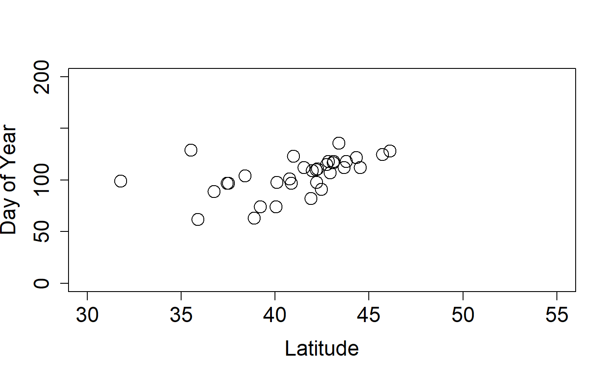

```{r setup, include=FALSE}
knitr::opts_chunk$set(echo = TRUE)
library(rnpn)
```

# Site Phenometrics


Site Phenometrics, derived from Individual Phenometrics, provide summary metrics of the onset and end date of phenophase activity for a species at a site. Observers are directed to create sites that represent uniform habitat and are no larger than 15 acres. For plants, this metric is calculated as an average for all individuals of a species at the site. For animals, where individuals are not tracked, this metric represents the first and last recorded appearance of the species during the season of interest. For instance, if you asked for red maple leafing data, and there was a site with three red maple trees being observed, then the data would be the average onset date for all three of those red maple trees at that site.


Here's an example of how to query the services for site phenometrics data, for cloned lilacs, breaking leaf buds, 2013. The call is very similar to the call for individual phenometrics data, however, in addition you can supply the quality control filter for the number of days between a yes record and preceding no record (also applies to the last yes and following no), for the observation to be included in the calculations. Typically this is set to 7, 14 or 30, as when downloading data using the USA-NPN Phenology Observation Portal. If you do not set this parameter, it defaults to 30 days. Note that in this example the results are stored in memory,  rather than output as a file.


```{r eval=FALSE}
LilacLeafPoints2013<-npn_download_site_phenometrics(
  request_source = 'Your Name Here', 
  years = c('2013'),
  num_days_quality_filter = '30',
  species_ids = '35',
  phenophase_ids = '373'
)

```


In this example we're able to see the date of the first observation of breaking leaf buds for cloned lilacs, averaged across individuals within sites. If any observation did not have a preceding no record within 30 days it was excluded from the calculations.


We can now plot our cloned lilac site phenometric onset data by latitude.


```{r eval=FALSE}
plot(
  mean_first_yes_doy~latitude, 
  data=LilacLeafPoints2013, 
  ylab=c("Day of Year"), 
  xlab=c("Latitude"),
  cex=2, 
  cex.axis=1.5, 
  cex.lab=1.5, 
  pch=21, 
  xlim=c(30,55), 
  ylim=c(0,200)
)
```
```{r, echo=FALSE, out.width = "50%", fig.pos="h"}

```


## An experimental alternative

`npn_export_site_phenometrics()` requests the same data product through the
newer asynchronous export service. It is experimental and sits alongside
`npn_download_site_phenometrics()` rather than replacing it; see
`vignette("IX_async_exports")`.

The legacy `taxonomy_aggregate` and `pheno_class_aggregate` booleans become
`taxon` and `phenophase_grain`, which name the grain rather than toggling it:

```{r eval=FALSE}
sites <- npn_export_site_phenometrics(
  start_date       = "2013-01-01",
  end_date         = "2013-12-31",
  species_ids      = c(35, 36),
  taxon            = "genus",
  phenophase_grain = "phenophase"
)
```

Note that the grain changes the columns you get back: at `taxon = "genus"` the
`species_id` / `species` / `common_name` block is replaced by `genus_id` /
`genus` / `genus_common_name`.

### Seasonal windows

`start_date` and `end_date` are required, and the range is decomposed into one
window per phenological year exactly as in
`vignette("III_individual_phenometrics")` --- see the worked example there. It
matters more here: the service groups by site, taxon and phenophase grain with
no year in the key, so an unwindowed three-year call would return one
cross-year mean where the windowed call returns three rows.
