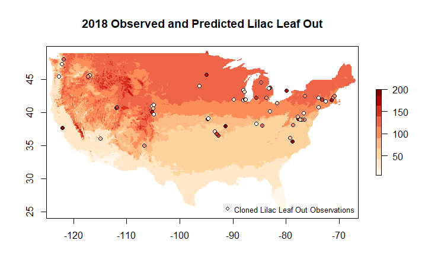

```{r setup, include=FALSE}
knitr::opts_chunk$set(echo = TRUE)
```
```{r eval=FALSE}
library(RColorBrewer)
library(rnpn)
library(sf)
library(terra)
```


## Combine Point and Raster Data

Observational and gridded data can be visualized or analyzed together for a variety of purposes. Users may want to identify spatial patterns in the alignment of dogwood bloom and the Spring Index bloom model. The current year's lilac leaf out observations may be compared to the 30 year average lilac sub-model of the spring index to see how well the model predicts the observations.

This example shows several data access calls to assemble observational and gridded data.


Option 1: You can add a parameter to an observational data call to additionally get a gridded layer value for each observation location/date. Note that if you don't specify which sub model of the Spring Index you want,  you will get the SI-x Average layers.

```{r eval=FALSE}
npn_download_site_phenometrics(
  request_source = 'Your Name Here', 
  years = '2013',
  num_days_quality_filter = '30', 
  species_ids = '35',
  phenophase_ids = '373', 
  download_path = 'cl_lilac_data_2013_SIxLeaf.csv',
  six_leaf_layer = TRUE,
  six_sub_model = 'lilac'
)
```

If you want to append raster data other than Spring Index, Leaf values, there's alternative boolean flags that can be set, including six_bloom_layer for Spring Index, Bloom data, and agdd_layer. Instead of TRUE or FALSE agdd_layer takes 32 or 50 and will correlate each data point with the corresponding AGDD value for the given date using either 32 or 50 base temperature.


Option 2: You can create a combined plot of observational data with modeled/raster data.

Building on the approach for accessing point data from earlier vignettes describing Individual Phenometrics and getting raster data, we can access and plot these products together. In this example, we will look at how well cloned lilac leaf out observations in 2018 are predicted by the lilac leaf sub model of the Spring Index.

### Step 1: Get the data

```{r eval=FALSE}
LilacLeaf2018 <- npn_download_geospatial(
  'si-x:lilac_leaf_ncep_historic', 
  '2018-01-01', 
)


LilacLeaf2018Obs <- npn_download_individual_phenometrics(
  request_source = 'Your Name Here', 
  years = '2018',
  species_ids = '35',
  phenophase_ids = '373' 
)
```


### Step 2: Preparing the data

```{r eval=FALSE}
# coords <- LilacLeaf2018Obs[ , c("longitude", "latitude")]
# data <- as.data.frame(LilacLeaf2018Obs$first_yes_doy)

crs <- st_crs("+proj=utm +zone=18 +datum=WGS84 +units=m +no_defs 
                 +ellps=WGS84 +towgs84=0,0,0")

LL_sf <- st_as_sf(
  LilacLeaf2018Obs,
  coords = c("longitude", "latitude"),
  crs = crs
)

```


### Step 3: Define style options and create graph

```{r eval=FALSE}
my.palette <- brewer.pal(n = 9, name = "OrRd")

plot(
  LilacLeaf2018, 
  col = my.palette,
  main = "2018 Observed and Predicted Lilac Leaf Out"
)

plot(
  LL_sf,
  main = "Lilac Obs",
  pch = 21,
  bg = my.palette,
  col = 'black',
  xlim = c(-125.0208, -66.47917),
  ylim = c(24.0625, 49.9375),
  add = TRUE
)

legend(
  "bottomright", 
  legend = c("Cloned Lilac Leaf Out Observations"),
  pch = 21,
  bg = 'white',
  col = 'black',
  bty = "n", 
  cex = 0.8
)

```
```{r, echo=FALSE, out.width = "50%", fig.pos="h"}

```
