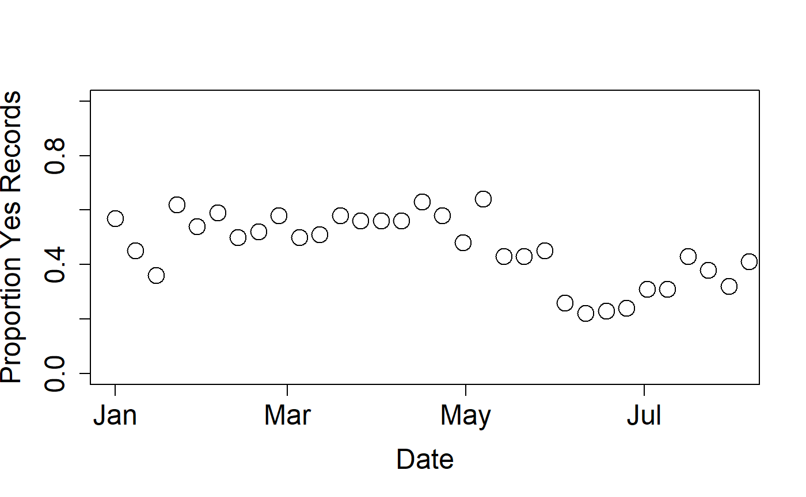

```{r setup, include=FALSE}
knitr::opts_chunk$set(echo = TRUE)
library(rnpn)
```

# Magnitude Phenometrics


Magnitude Phenometrics are a suite of eight metrics derived from Status and Intensity data. This data type provides information on the extent to which a phenophase is expressed across multiple individuals or sites, for a given set of sequential time intervals. The data user may select a weekly, bi-weekly, monthly, or custom time interval to summarize the metrics. Two metrics are available for both plants and animals, one metric is available for plants alone and five metrics are available for animals alone (table 1). Three of the five animal metrics correct animal abundance values for observer effort in time and space.


Here's an example of how to query for Magnitude Phenometrics, for the active individuals phenophase for black-capped chickadee data, in 2018. Requirements are similar to other data types. You must additionally specify the time interval by which the data should be summarized. Typically this is weekly, biweekly or monthly, as in the POP and Visualization Tool. The interval chosen in this example is 7 days.


```{r eval=FALSE}
npn_download_magnitude_phenometrics(
  request_source = 'Your Name Here', 
  years = '2018',
  period_frequency = "7",
  species_ids = '245', 
  phenophase_ids = '292', 
  download_path = 'MPM_BCC_ActInd_2018.csv'
)
```


In this example we're able to see all of the magnitude phenometric fields, including proportion_yes_records, and mean_num_animals_in-phase. See the [Open File Report on USA-NPN Observational Data](https://pubs.usgs.gov/of/2018/1060/ofr20181060.pdf) for full field descriptions.


From this dataset we can view the Proportion_Yes_Records (of all the records submitted on this species, what proportion are positive/yes records) by weekly interval:

```{r eval=FALSE}
BCC_AI<-read.csv(
  'MPM_BCC_ActInd_2018.csv', 
  header = TRUE, 
  na=-9999, 
  stringsAsFactors = FALSE
)

plot(
  BCC_AI$proportion_yes_record~as.Date(BCC_AI$start_date,"%Y-%m-%d"), 
  ylab=c("Proportion Yes Records"), 
  xlab=c("Date"),
  cex=2, 
  cex.axis=1.5, 
  cex.lab=1.5, 
  pch=21,
  xlim=as.Date(c("2018-01-01", "2018-08-01")),
  ylim=c(0,1)
)
```
```{r, echo=FALSE, out.width = "50%", fig.pos="h"}



